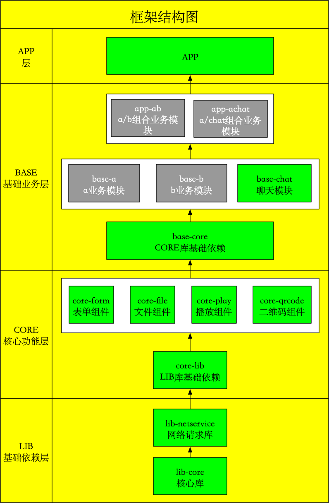

# 安卓快速开发框架 [ABCL](https://github.com/hslooooooool/abcl)

## 项目介绍

### 前言
本项目为作者工作以来通过学习、爬坑、思考与创新后所得。

此框架前身经过了生产级项目的使用验证，切实可行的帮助了我任职公司安卓开发人员工作，减少了搭建基础框架的时间，提升开发效率的同事也借此规范公司的开发，提高并行编程效率。

为避免因作者个人能力导致的过度设计、设计缺陷等问题，暂定框架的开发边界仅为安卓核心功能，如需要常用工具、自定义控件请自行拓展。

项目中所引入的架包和工具尽可能使用最新版本。

### 结构：



### 技术特征

- Android Jetpack(AndroidX)
- Lifecycles/LiveData/ViewModel/Room/Paging
- MVVM/MVP
- Android KTX
- RxJava/RxAndroid
- Retrofit2/OKHttp3
- ARouter
- Kotlin

### 使用成本

- Android Studio 3.4+
- Gradle 5.1.1+
- Kotlin 1.3.31+
- CompileSdkVersion 28+

### 引入方式

推荐方式：

- 下载本[框架demo]("https://github.com/hslooooooool/abcl")快速开始。
    ```git clone
    git clone https://github.com/hslooooooool/abcl.git
    ```
    
    或
    
    ```
    dependencies {

        /*abcl base-core库依赖*/
        api 'vip.qsos:core:1.0.0'
    }
    ```

### 开发约定

- lib层仅维护实体对象，资源、路由、常量
- 独有功能在base和core间增加并在base-core中依赖
- 开发满足[开发规范]("https://github.com/hslooooooool/dev-doc/")

#### 其它需求

如果您有其它想法，取其中部分功能又不想破坏其结构，也为避免您可能无需其中的某些功能，且不想增大APP包大小，您可以通过以下方式进行配置，方可自行配置您需要的功能：
- 框架配置的方式（模块配置），含所有功能，会下载无关的代码，但无关代码不会被编译打包

    下载代码
    ```git clone
      git clone https://github.com/hslooooooool/abcl.git
    ```
    
    在项目的gradle.properties中修改如下代码

    ```gradle.properties
        # 聊天
        chatIsModule=true

        # 播放
        playIsModule=true
        # 表单
        formIsModule=true
        # 文件
        fileIsModule=true
        # 二维码
        qrcodeIsModule=true

        # AndroidX 使用
        android.useAndroidX=true
        android.enableJetifier=true
        org.gradle.jvmargs=-XX:MaxHeapSize=2048m -Xmx2048m -Dfile.encoding=UTF-8
    ```

    当其中某项配置为false时，就不会将其作为您APP的依赖，而作为单独的工程。

### 各功能介绍

- 聊天列表与交互 [base-chat]("")

- 二维码 [core-qrcode]("")
- 动态表单 [core-form]("")
- 拍照、图库选择、文件选择、视频录制、音频录制 [core-file]("")
- 视频播放、图片画廊 [core-play]("")

- Retrofit网络请求 [lib-netservice]("")
- 基础框架（基础配置、路由管理、数据库管理、常量管理、工具类） [lib-base]("")

# 感谢

感谢项目中用到的所有开源框架、感谢安卓、感谢谷歌

# 联系

如果您有框架方面的疑问和建议，您可以直接提交建议或通过以下方式联系我，一起学习。

| 方式 | 地址 |
|---|---|
| github | <https://github.com/hslooooooool> |
| email | 821034742@qq.com |
| 博客 | <http://www.qsos.vip> |
| 语雀 | <http://www.yuque.com/qsos>  |
| 简书 | <http://www.jianshu.com/u/57cc7206b1b2> |
| 掘金 | <http://juejin.im/user/57d0b35d2e958a0054483695>  |

# 未来

- 自定义流程业务
- Flutter

